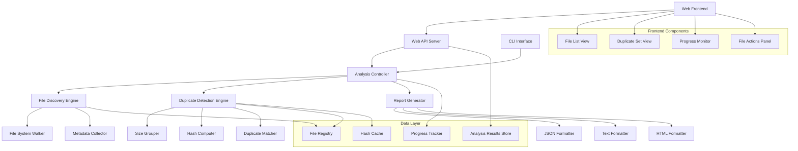

# Design Document: Duplicate File Analyzer

## Overview

The Duplicate File Analyzer is a high-performance tool designed to efficiently identify duplicate files across large directory structures. The system employs a multi-stage approach that optimizes for both speed and accuracy while maintaining low memory usage.

The core algorithm follows a proven three-stage approach:

1. **Size-based filtering**: Group files by size to eliminate obvious non-duplicates
2. **Hash-based comparison**: Compute content hashes only for files with matching sizes
3. **Verification**: Optional byte-by-byte comparison for absolute certainty

This design prioritizes I/O efficiency over CPU usage, as file system operations typically represent the primary bottleneck in large-scale file analysis.

## Architecture

The system follows a modular architecture with clear separation of concerns:



## Components and Interfaces

### File Discovery Engine

**Purpose**: Efficiently traverse directory structures and collect file metadata.

**Key Components**:

- `FileSystemWalker`: Handles recursive directory traversal with symlink protection
- `MetadataCollector`: Extracts file size, path, and modification time
- `FileRegistry`: In-memory store for file metadata with efficient lookups

**Interface**:

```typescript
interface FileDiscoveryEngine {
  discoverFiles(
    rootPath: string,
    options: DiscoveryOptions
  ): AsyncIterator<FileMetadata>;
  getFileCount(): number;
  getProcessedBytes(): number;
}

interface FileMetadata {
  path: string;
  size: number;
  modifiedTime: Date;
  isAccessible: boolean;
}
```

### Duplicate Detection Engine

**Purpose**: Implement the multi-stage duplicate detection algorithm.

**Key Components**:

- `SizeGrouper`: Groups files by size for efficient processing
- `HashComputer`: Computes content hashes using streaming I/O
- `DuplicateMatcher`: Identifies and groups duplicate files

**Interface**:

```typescript
interface DuplicateDetectionEngine {
  findDuplicates(files: FileMetadata[]): Promise<DuplicateSet[]>;
  setHashAlgorithm(algorithm: HashAlgorithm): void;
  setParallelism(threadCount: number): void;
}

interface DuplicateSet {
  files: FileMetadata[];
  hash: string;
  totalSize: number;
  potentialSavings: number;
}
```

### Hash Computer

**Purpose**: Efficiently compute file content hashes with streaming I/O.

The hash algorithm selection balances speed and collision resistance:

- **Primary**: SHA-256 for security and wide compatibility
- **Alternative**: xxHash for maximum speed when security isn't critical
- **Fallback**: MD5 for legacy compatibility (with collision warnings)

**Interface**:

```typescript
interface HashComputer {
  computeHash(filePath: string): Promise<string>;
  computePartialHash(filePath: string, bytes: number): Promise<string>;
  setAlgorithm(algorithm: "sha256" | "xxhash" | "md5"): void;
}
```

### Web API Server

**Purpose**: Provide HTTP endpoints for the web frontend to interact with the analysis engine.

**Key Components**:

- `AnalysisEndpoints`: REST API for starting, monitoring, and retrieving analyses
- `FileEndpoints`: API for accessing file metadata and duplicate information
- `WebSocketHandler`: Real-time progress updates and notifications

**Interface**:

```typescript
interface WebAPIServer {
  startAnalysis(request: AnalysisRequest): Promise<AnalysisSession>;
  getAnalysisStatus(sessionId: string): Promise<AnalysisStatus>;
  getAnalysisResults(sessionId: string): Promise<AnalysisResult>;
  getFileInfo(filePath: string): Promise<FileMetadata>;
  deleteFile(filePath: string): Promise<boolean>;
}

interface AnalysisRequest {
  targetDirectory: string;
  options: AnalysisOptions;
  excludePatterns?: string[];
}

interface AnalysisSession {
  sessionId: string;
  status: "running" | "completed" | "failed";
  progress: number;
  startTime: Date;
  estimatedCompletion?: Date;
}
```

### Web Frontend Components

**Purpose**: Provide an intuitive web interface for managing duplicate file analysis.

**Key Components**:

#### File List View

- Display all discovered files with metadata
- Sort and filter capabilities
- File selection for bulk operations
- Visual indicators for duplicates

#### Duplicate Set View

- Group duplicate files together
- Show potential space savings
- Provide file comparison tools
- Enable selective deletion

#### Progress Monitor

- Real-time analysis progress
- Performance metrics display
- Error notification system
- Cancel/pause functionality

#### File Actions Panel

- Delete selected duplicates
- Open file locations
- Preview file contents
- Export analysis results

**Frontend Interface**:

```typescript
interface WebFrontend {
  displayAnalysisResults(results: AnalysisResult): void;
  showDuplicateSet(duplicateSet: DuplicateSet): void;
  updateProgress(progress: ProgressUpdate): void;
  handleFileAction(action: FileAction, files: string[]): Promise<void>;
}

interface FileAction {
  type: "delete" | "open" | "preview" | "export";
  confirmation?: boolean;
}

interface ProgressUpdate {
  filesProcessed: number;
  totalFiles: number;
  currentFile: string;
  bytesProcessed: number;
  duplicatesFound: number;
}
```

## Data Models

### File Metadata Model

```typescript
interface FileMetadata {
  path: string; // Absolute file path
  size: number; // File size in bytes
  modifiedTime: Date; // Last modification timestamp
  isAccessible: boolean; // Whether file can be read
  hash?: string; // Content hash (computed on demand)
}
```

### Duplicate Set Model

```typescript
interface DuplicateSet {
  id: string; // Unique identifier for the set
  files: FileMetadata[]; // All files with identical content
  hash: string; // Content hash shared by all files
  totalSize: number; // Size of each file in the set
  potentialSavings: number; // Bytes that could be saved (totalSize * (files.length - 1))
  detectionMethod: "hash" | "content"; // How duplicates were verified
}
```

### Analysis Result Model

```typescript
interface AnalysisResult {
  duplicateSets: DuplicateSet[];
  totalFilesAnalyzed: number;
  totalDuplicateFiles: number;
  totalPotentialSavings: number;
  analysisTime: number;
  errors: AnalysisError[];
}
```

## Correctness Properties

_A property is a characteristic or behavior that should hold true across all valid executions of a system-essentially, a formal statement about what the system should do. Properties serve as the bridge between human-readable specifications and machine-verifiable correctness guarantees._

Based on the prework analysis, I've identified several properties that can be combined for more comprehensive testing:

**Property Reflection:**

- Properties 1.1 and 1.4 can be combined into a comprehensive directory traversal property
- Properties 2.1, 2.2, and 2.5 can be combined into an algorithm efficiency property
- Properties 4.1, 4.2, and 4.3 can be combined into a comprehensive reporting property
- Properties 5.1, 5.3, and 5.4 can be combined into an error handling property

### Property 1: Complete Directory Traversal

_For any_ directory structure, when analyzing a target directory, all accessible files in all subdirectories should be discovered and have complete metadata collected
**Validates: Requirements 1.1, 1.4**

### Property 2: Graceful Error Handling

_For any_ inaccessible files or permission errors encountered during analysis, the system should log the error, continue processing other files, and include all errors in the final summary
**Validates: Requirements 1.3, 5.1, 5.3, 5.4**

### Property 3: Efficient Algorithm Ordering

_For any_ set of files being analyzed, size comparison should occur before hash computation, and hash computation should only occur for files with matching sizes
**Validates: Requirements 2.1, 2.2, 2.5**

### Property 4: Correct Duplicate Grouping

_For any_ files with identical content hashes, they should be grouped together as a single duplicate set
**Validates: Requirements 2.4**

### Property 5: Progress Reporting

_For any_ long-running analysis operation, progress indicators should be emitted at regular intervals
**Validates: Requirements 3.5**

### Property 6: Complete Duplicate Reporting

_For any_ duplicate set found, the report should include all files in the set with complete metadata (paths, sizes, modification dates) and correct space savings calculations
**Validates: Requirements 4.1, 4.2, 4.3**

### Property 7: Proper Result Sorting

_For any_ analysis result, duplicate sets should be sorted by potential space savings in descending order
**Validates: Requirements 4.4**

### Property 8: Concurrent Modification Handling

_For any_ files modified during analysis, the system should detect the changes and handle them appropriately without corrupting results
**Validates: Requirements 5.2**

### Property 9: Graceful Interruption Handling

_For any_ analysis that is interrupted, partial results should be available and valid up to the point of interruption
**Validates: Requirements 5.5**

### Property 10: Filtering Functionality

_For any_ specified file types or directories to exclude, those files should not appear in the analysis results
**Validates: Requirements 6.4**

### Property 11: Resume Capability

_For any_ interrupted analysis with cached intermediate results, resuming should continue from where it left off and produce equivalent final results
**Validates: Requirements 6.5**

### Property 12: Web Interface Duplicate Display

_For any_ completed analysis, the web interface should display all duplicate sets with complete file metadata and clickable file links
**Validates: Requirements 7.1, 7.2, 7.3**

### Property 13: Web Interface Progress Updates

_For any_ running analysis, the web interface should display real-time progress updates including current file and percentage completion
**Validates: Requirements 7.6, 7.7**

### Property 14: Web Interface File Actions

_For any_ file selection and deletion action, the web interface should require confirmation and successfully execute the requested operations
**Validates: Requirements 7.4, 7.5**

### Property 15: Web Interface Result Sorting and Export

_For any_ analysis results displayed in the web interface, duplicate sets should be sorted by space savings and export functionality should produce valid output files
**Validates: Requirements 7.9, 7.10**

## Error Handling

The system implements comprehensive error handling to ensure robust operation:

### Error Categories

1. **File System Errors**: Permission denied, file not found, I/O errors
2. **Hash Computation Errors**: Corrupted files, locked files, insufficient memory
3. **System Errors**: Out of memory, disk full, process interruption

### Error Handling Strategy

- **Graceful Degradation**: Continue processing when individual files fail
- **Comprehensive Logging**: Record all errors with context for debugging
- **User Notification**: Provide clear error summaries in results
- **Partial Results**: Return valid results even when some operations fail

### Recovery Mechanisms

- **Retry Logic**: Automatic retry for transient errors (with exponential backoff)
- **Checkpoint System**: Save intermediate results for resume capability
- **Memory Management**: Automatic cleanup when memory pressure is detected

## Testing Strategy

The testing approach combines unit tests for specific scenarios with property-based tests for comprehensive coverage:

### Unit Testing

- **File System Operations**: Test directory traversal, symlink handling, permission errors
- **Hash Computation**: Test different algorithms, file sizes, and error conditions
- **Data Structures**: Test file registry, duplicate grouping, result formatting
- **Edge Cases**: Empty directories, single files, very large files

### Property-Based Testing

- **Framework**: Use fast-check (JavaScript/TypeScript) or Hypothesis (Python) for property testing
- **Test Configuration**: Minimum 100 iterations per property test
- **Generators**: Smart generators for file systems, directory structures, and file content
- **Coverage**: Each correctness property implemented as a separate property test

### Integration Testing

- **End-to-End Scenarios**: Complete analysis workflows with various directory structures
- **Performance Testing**: Memory usage, processing speed, scalability limits
- **Concurrent Testing**: Multiple analyses, file modifications during processing

### Test Data Generation

- **Synthetic File Systems**: Generate random directory structures with known duplicates
- **Content Variation**: Files with identical content, similar content, unique content
- **Size Distribution**: Mix of small, medium, and large files for realistic testing
- **Error Injection**: Simulate permission errors, I/O failures, system interruptions

Each property-based test will be tagged with: **Feature: duplicate-file-analyzer, Property {number}: {property_text}**
